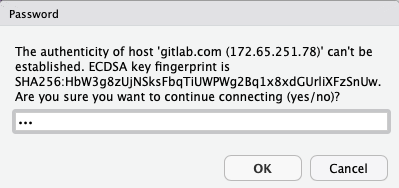

<a rel="license" href="http://creativecommons.org/licenses/by/4.0/"></a>

# Git training

[This repository](https://gitlab.b-data.ch/git/git-training) contains all
material used during on-site training sessions for several customers.
Typically, their setup is as follows:

1.  RStudio Server Pro
    *  git, nano, r-base, ssh-client
2.  GitLab Community Edition (CE)  
    → Omnibus package (recommended installation)

Both applications running on Ubuntu Server (LTS, 64-bit).  
:information_source: As of 2020-04-29: Git v2.17.1 on RStudio Server Pro (Ubuntu
18.04 LTS).

# Inspiration

This tutorial was inspired by Hadley Wickham's
[Git and GitHub · R packages](http://r-pkgs.had.co.nz/git.html). I highly
recommend reading this chapter of his book on R packages.  
:information_source: There is a second edition available at
https://r-pkgs.org/git.html.

Worth mentioning is Jenny Bryan's far more extensive
[Happy Git and GitHub for the useR](https://happygitwithr.com/), which also
covers common problems seen on major platforms and possible solutions.

# Prerequisites

All instructions in this tutorial focus on the use of Git with RStudio Server.
If you use RStudio Desktop, please see https://git-scm.com/downloads on how to
install Git on your PC.

To carry out the instructions on your own, the following is required:

1.  A PC with internet access
1.  RStudio Server or Desktop 
1.  GitLab CE or [GitLab.com](https://gitlab.com)  
    :exclamation: Please use Firefox (recommended) or Microsoft Edge, **not**
    Internet Explorer (IE).

GitLab and Git are stand-alone software tools that can be used independently
from RStudio. GitLab may also be used for projects with Matlab, Python, etc. as
version control system (VCS).

---

For every action performed with RStudio's **Git pane** the equivalent shell
commands will be provided. These may be executed using RStudio **Terminal** (or
**Git bash**).

---

:exclamation: The provided non-git commands are Linux specific. If you are
working with Microsoft Windows, you have to find the corresponding command
yourself.

## Git over SSH

It is strongly recommended using an SSH connection when interacting with GitLab.
SSH keys are a way to identify trusted computers, without involving passwords.

However, many corporate networks block SSH connections (port 22/tcp) to the
outside world (aka Internet). In this case you must use Git over HTTPS.

:exclamation: When Two-Factor Authentication (2FA) is enabled you can no longer
use your normal account password to authenticate with Git over HTTPS on the
command line or when using GitLab’s API. You must use a [personal access token](https://docs.gitlab.com/ce/user/profile/personal_access_tokens.html)
instead.

# Terminal

> The RStudio **Terminal** provides access to the system shell from within the
> RStudio IDE. It supports xterm emulation, enabling use of full-screen terminal
> applications (e.g. text editors, terminal multiplexers) as well as regular
> command-line operations with line-editing and shell history.
> 
> There are many potential uses of the shell including advanced source control
> operations, execution of long-running jobs, remote logins, [...]
> 
> The **Terminal** tab is next to the **Console** tab. Click on the Terminal tab
> and a new terminal session will be created (if there is not one already).
> 
> *  If the tab is not visible, show it via `Shift+Alt+T` (**Tools > Terminal >
>    Move Focus to Terminal**).

— [Using the RStudio Terminal - RStudio Support](https://support.rstudio.com/hc/en-us/articles/115010737148-Using-the-RStudio-Terminal)

**Keyboard shortcuts**

*  Copy: `Ctrl+Insert`
*  Paste: `Shift+Insert`

:point_right: These keyboard shortcuts also work in the **Source** editor and
the **Console** tab.

# Setup

First, you are going to clone this project, [configure Git](#configure-git),
[generate a SSH key pair](#generate-ssh-key-pair) in RStudio and
[add the SSH public key](#add-ssh-public-key-to-gitlab) to GitLab.

## How to clone this project (with HTTPS)

1.  **Copy the project's URL:** `https://gitlab.b-data.ch/git/git-training.git`  
2.  **In RStudio go to Menu "File" > "New Project" > "Version Control"**  
    
3.  **Select "Git"**  
    
4.  **Paste the copied URL into field "Repository URL:"**  
    
5.  **Click "Create project"**  

---

```bash
cd ~/projects
git clone https://gitlab.b-data.ch/git/git-training.git
```
Open file "[git-training.Rproj](git-training.Rproj)" using RStudio's Files pane
(bottom right).

---

## Configure Git

---

```bash
git config --global user.name "<Name>"
git config --global user.email <Email>
```

---

:point_right: Replace `<Name>` (e.g. `Hans Muster`) and `<Email>` (e.g.
`hans.muster@domain.tld`) according to your GitLab CE or
[GitLab.com](https://gitlab.com/profile) profile.

One might also consider setting `core.editor` and `merge.conflictstyle`, e.g.

---

```bash
git config --global core.editor nano
git config --global merge.conflictstyle diff3
```

---

## Generate SSH key pair

See [Generating a new SSH key and adding it to the ssh-agent - GitHub help](https://help.github.com/en/github/authenticating-to-github/generating-a-new-ssh-key-and-adding-it-to-the-ssh-agent)
for full instructions when working with Mac, Windows or Linux.

Otherwise:

---

```bash
ssh-keygen -t rsa
```

```bash
Generating public/private rsa key pair.
Enter file in which to save the key (/home/<user>/.ssh/id_rsa): 
Enter passphrase (empty for no passphrase): 
Enter same passphrase again: 
Your identification has been saved in /home/<user>/.ssh/id_rsa.
Your public key has been saved in /home/<user>/.ssh/id_rsa.pub.
[...]
```

:point_right: Accept default values by pressing `Enter`.

---

## Add SSH public key to GitLab

### In RStudio: Copy SSH public key

Open Menu **"Tools" > "Global Options"**:

*  **"Git/SVN"**
    *  SSH RSA key: **View public key**    
          
        :point_right: Select and press Ctrl+C to copy the key to the clipboard.

### On GitLab: Add SSH public key

Open **"User Settings" > "SSH Keys"** on GitLab CE or
[GitLab.com](https://gitlab.com/profile/keys), paste your SSH Key into the field
"Key" and click "Add Key".


# My first repository

## In GitLab: Create new project
**To add a new project** to your GitLab account press the "+" sign  on the menu
bar and click on "New project".


**On the next page**

1.  choose a suitable "Project name"  
    :point_right: If you have not yet created a group, your user name will be
    automatically added to the "Project URL".
1.  (optional) modify the "Project slug"  
1.  set "Visibility Level" to "Public"

and click on "Create project".


:point_right: Use "Visibility Level" "Private" only, if you do not want the
project being publicly accessible.

## Clone your GitLab project with SSH

1.  **Copy the projects's URL:** `git@gitlab.com:<user>/<project-name>.git`  
    :point_right: `<user>` and `<project-name>` depend on your setup.
2.  Follow steps 2-5 of
[How to clone this project (with HTTPS)](#how-to-clone-this-project-with-https)  
    :point_right: **Tick "Open in new session"** before **clicking "Create
    Project"**.
3.  While cloning a repository for the first time, you will be asked if you want
    to connect to the host.  
      
    **Write "yes"** and **click "OK"**.

---

```bash
cd ~/projects
git clone git@gitlab.com:<user>/<project-name>.git
```
Open file "\<project-name\>.Rproj" using RStudio's Files pane (bottom right).

**`git clone <repository>`** clones a **repository** into a newly created
directory. It automatically

1.  creates remote-tracking branches for each branch in the cloned repository.
    *  visible using `git branch --remotes`.
2.  checks out an initial branch that is forked from the cloned repository.
    *  from the active branch (default: _master_).

---

### You are ready to go!

# Beginner session

See tutorial in [beginner.md](beginner.md)

# Intermediate session

See tutorial in [intermediate.md](intermediate.md)

# GitLab vs GitHub

Both GitLab (and [GitLab.com](https://gitlab.com)) and GitHub
(and [GitHub.com](https://github.com)) are products providing a Git repository
hosting service.

## Similarities

Along with [GitLab.com](https://gitlab.com), GitLab has two versions, GitLab
Community Edition (CE) and GitLab Enterprise Edition (EE), for
[self-hosting](https://about.gitlab.com/pricing/#self-managed). Similarily,
GitHub has [GitHub.com](https://github.com) and
[GitHub Enterprise](https://github.com/enterprise). As of now, both GitLab and
GitHub offer (almost) the same features.

*  The main advantage of GitLab is its open source nature, which allows you to
   run GitLab on your own servers.

*  GitLab is newer than GitHub, so naturally it is a little less popular than
   GitHub.

## Differences

The naming of features differs a little bit:


— [Comparing confusing terms in GitHub, Bitbucket, and GitLab (2017) | GitLab](https://about.gitlab.com/blog/2017/09/11/comparing-confusing-terms-in-github-bitbucket-and-gitlab/)

**Furthermore**

> *  GitLab allows unlimited private repositories for free whereas for GitHub, it
>    is [not free](https://github.com/pricing)*.
> *  GitLab has its own CI software (called
>    [GitLab CI](https://about.gitlab.com/product/continuous-integration/)),
>    which removes your reliance on external service like Travis.

— [What are the differences between GitHub & GitLab? - Quora](https://www.quora.com/What-are-the-differences-between-GitHub-GitLab)  
*As of April 14, 2020, private GitHub repositories with unlimited collaborators
are free for everyone.

:information_source: See also GitLab’s own comparison
[GitHub vs GitLab](https://about.gitlab.com/devops-tools/github-vs-gitlab.html).
