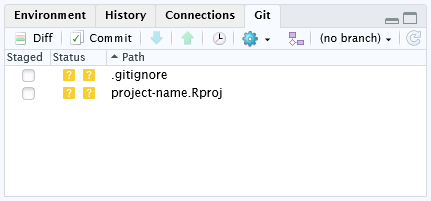
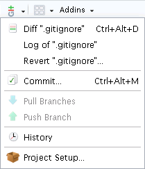
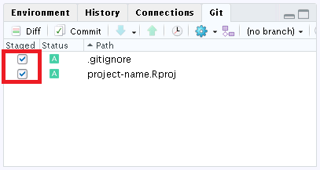
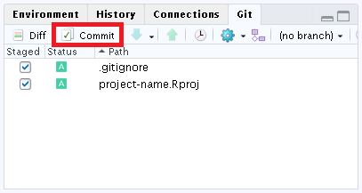
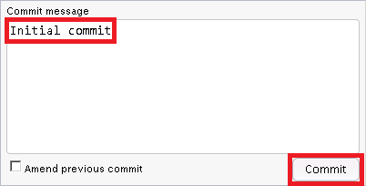
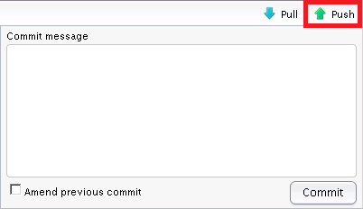
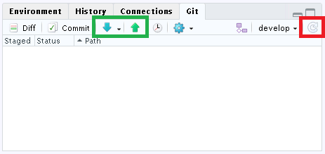

# Git training: Beginner


**Goals**:

*  Know the most important Git terms and commands
*  Use a Git gepository as a single user
*  Work with RStudio's Git pane

# Terminology (part 1)

## Git basics

### Locations: local, remote

*  A **local repository** is a directory named ".git" that contains all of your
   necessary repository files — a Git repository.
*  **Remote repositories** are versions of your project that are hosted on the
   Internet or network somewhere.  
   :information_source: The default remote name is _origin_.

### Storage areas: working directory, staging area, repository

*  The **working directory** (**workspace**) is a local checkout of the
   repository, placing files on disk for you to use or modify.
*  The **staging area** (**index**) stores information about what will go into
   your next commit.
*  The **repository** (**".git" directory**) is where Git stores the metadata
   and object database for your project.  
   :point_right: This is the most important part of Git, and it is what is
   copied when you clone a repository from another computer.


— [Git - What is Git? > The Three States](https://git-scm.com/book/en/v2/Getting-Started-What-is-Git%3F)

The basic Git workflow goes something like this:

*  You modify files in your **working directory**.
*  You selectively stage the files, adding those changes to the
   **staging area**.
*  You do a commit, which takes the files in the **staging area** and stores
   them permanently to your **repository**.

### Branches

Branching means you diverge from the main line of development and continue to do
work without messing with that main line.  
:information_source: The default branch name is _master_.

# Use cases

## Single user, private

See [Use cases > Single user, private](use-cases.md#single-user-private).

## Single user, shared

See [Use cases > Single user, shared](use-cases.md#single-user-shared).  
:point_right: Using RStudio's Git pane.

# Hands-on training

## RStudio: Working with the Git pane

RStudio makes day-to-day use of Git simpler. Once you have set up a project to
use Git, you will see a new pane and toolbar icon:

*  The **Git pane**, at the top-right, shows you what files have changed and
   includes buttons for the most important Git commands:  
   
*  The **git dropdown** menu, found in the toolbar, includes Git commands that
   apply to the current file (here ".gitignore"):  
   

These provide shortcuts to the most commonly used Git commands. However, because
only a handful of the 150+ Git commands are available in RStudio, **you also
need to be familiar with using Git from the shell** (aka the command line or the
terminal).

### The initial commit

Since the repository on GitLab is still empty, we must commit our changes and
push them to GitLab first. Without any further changes the _Initial commit_
will consist of the following files:

1.  ".gitignore"
2.  "\<project-name\>.Rproj"

The _initial commit_ automatically creates branch _master_, both locally
(after commit) and remotely on GitLab (after push).

1.  Add files to the **staging area**:  
      
    
    ---
    
    ```bash
    git add .
    ```
    
    **`git add .`** stages new/modified/deleted files in the current directory.
    
    ---
2.  Commit changes to the **local repository**:  
      
    *  Edit commit message and click "Commit":  
         
    
    ---
    
    ```bash
    git commit -m "Initial commit"
    ```
    
    **`git commit -m "Initial commit"`** creates a new commit on branch _master_
    containing the current contents of the **staging area** and uses log message
    "Initial commit" describing the changes.
    
    ---
4.  Push branch to _origin_ (GitLab):  
      

    ---
    
    ```bash
    git push -u origin master
    ```
    
    **`git push -u origin <branch>`** pushes the checked out **local** branch
    to the corresponding **remote** branch at _origin_ and adds an upstream
    (tracking) reference, used by argument-less `git pull` and other commands.
    
    ---

You proceed the same way with every further commit.  
:point_right: You do not have to use option `-u origin master` for further
commits,

---

```bash
git push
```

---

is sufficient.

### Commit messages

The first line of a commit message is called the subject line and should be
brief (50 characters or less). For complicated commits, you can follow it with
a blank line and then a paragraph or bulleted list providing more detail. Write
messages in imperative, like you're telling someone what to do: "fix this bug",
not "fixed this bug" or "this bug was fixed".  
:information_source: For detailed information see
[How to Write a Git Commit Message](https://chris.beams.io/posts/git-commit/).

# Terminology (part 2)

## Git files

### .gitignore

A ".gitignore" file specifies intentionally untracked files that Git should
ignore. Files already tracked by Git are not affected.  

Each line in a ".gitignore" file specifies a pattern, deciding whether to ignore
a path or file.  
:point_right: see [git - gitignore Documentation > pattern format](https://git-scm.com/docs/gitignore#_pattern_format)
for a comprehensive explanation on the pattern format.

**About .gitkeep**

> `.gitkeep` isn’t documented, because it’s not a feature of Git.
> 
> Git [cannot add a completely empty directory](https://git.wiki.kernel.org/index.php/Git_FAQ#Can_I_add_empty_directories.3F).
> People who want to track empty directories in Git have created the convention
> of putting files called `.gitkeep` in these directories. The file could be
> called anything; Git assigns no special significance to this name.
> 
> There is a competing convention of adding a `.gitignore` file to the empty
> directories to get them tracked, but some people see this as confusing since
> the goal is to keep the empty directories, not ignore them; `.gitignore` is
> also used to list files that should be ignored by Git when looking for
> untracked files.

— [git - What are the differences between .gitignore and .gitkeep? - Stack Overflow](https://stackoverflow.com/questions/7229885/what-are-the-differences-between-gitignore-and-gitkeep)

I prefer ".keep" files instead of ".gitkeep" files to preserve these empty
folders, since Git is not the only VCS that does not track empty folders.

## Git commands

### "Inbound"

*  **`git fetch`** updates all branches from **remote repositories** (default:
   _origin_).
*  **`git pull`** merges (incorporates) changes from a **remote repository**
   (default: _origin_) into the current branch (default: _master_).
*  **`git checkout <branch>`** updates the **staging area** and the files in the
   **working directory**.  
   :information_source: Local modifications to the files in the **working
   directory** are kept, so that they can be committed to the `<branch>`.

**What is `HEAD`?**  
When you switch branches with `git checkout <branch>`, `HEAD` points to the tip
of that branch.

**What is a "detached `HEAD`"?**  
When you checkout a commit with `git checkout <commit>`, Git switches into a
"detached `HEAD`" state.  
:information_source: That is because the `checked out` commit is not the tip of
that branch.

### "Outbound"

*  **`git add .`** stages new/modified/deleted files in the current directory.
*  **`git add --ignore-removal .`** stages new/modified files in the current
   directory.
*  **`git add -u .`** stages modified/deleted files in the current directory.
*  **`git reset .`** unstages any staged files in the current directory.
*  **`git commit`** opens an editor to edit the commit log message and creates
   a new commit containing the current contents of the **staging area**.
*  **`git push`** pushes the checked out **local** branch to the corresponding
   **remote** branch (default remote: _origin_).

### Other

*  **`git status -s`** displays a summary about the differences between
    1.  the **staging area** and the **repository** (current `HEAD` commit),
    2.  the **working directory** and the **staging area**, and 
    3.  changes that are not tracked by Git  
        :point_right: and not ignored by gitignore.
    
    The first are what you _would_ commit by running `git commit`; the second
    and third are what you _could_ commit by running `git add` before running
    `git commit`.
*  **`git diff`** displays the changes you made relative to the **staging area**.
   In other words, the differences are what you _could_ tell Git to further add
   to the **staging area** but you still have not.  
   :exclamation: _Untracked_ files are excluded from `git diff`.
*  **`git log --graph --all`** shows the commit logs with a text-based graphical
   representation of the commit history for all branches on the left hand side
   of the output. 

## GitLab

### Projects

In GitLab, you can create projects for hosting your codebase and collaborate on
code.  
:information_source: See also
[GitLab Help > Projects](https://gitlab.b-data.ch/help/user/project/index.md).

GitLab projects are not just repositories but offer a large number of additional
features:

**Repositories:**

*  [Repositories](https://gitlab.b-data.ch/help/user/project/repository/index.md):
   Host your code in a fully integrated platform
    *  [Branches](https://gitlab.b-data.ch/help/user/project/repository/branches/index.md):
       use Git branching strategies to collaborate on code
    *  [Protected branches](https://gitlab.b-data.ch/help/user/project/protected_branches.md):
       Prevent collaborators from messing with history or pushing code without review

**Issues and merge requests:**

*  [Issue tracker](https://gitlab.b-data.ch/help/user/project/issues/index.md):
   Discuss implementations with your team within issues
    *  [Issue Boards](https://gitlab.b-data.ch/help/user/project/issue_board.md):
       Organize and prioritize your workflow
*  [Merge Requests](https://gitlab.b-data.ch/help/user/project/merge_requests/index.md):
   Apply your branching strategy and get reviewed by your team
    *  [Merge Request Approvals](https://gitlab.b-data.ch/help/user/project/merge_requests/merge_request_approvals.md):
       Ask for approval before implementing a change
    *  [Fix merge conflicts from the UI](https://gitlab.b-data.ch/help/user/project/merge_requests/resolve_conflicts.md):
       Your Git diff tool right from GitLab's UI

**Other features:**

*  [Wiki](https://gitlab.b-data.ch/help/user/project/wiki/index.md):
   document your GitLab project in an integrated Wiki.
*  [Snippets](https://gitlab.b-data.ch/help/user/snippets.md):
   store, share and collaborate on code snippets.

# Next

See tutorial in [intermediate.md](intermediate.md)

# FAQ

### Why Git?

1.  [CVS](https://savannah.nongnu.org/projects/cvs) is outdated (latest release:
    May 8, 2008).
2.  Branching/Merging in [SVN](https://subversion.apache.org) is not intuitive.
3.  Use Git – like everyone else.

### But WHY?

There are many reasons:

*  Collaboration
*  Revision history
*  Branching/Merging
*  Decentralized backup
*  ...

### How do I add Git to an existing RStudio project and connect it to GitLab?

#### GitLab

Create a new project according to
[My first repository](README.md#my-first-repository).

#### RStudio

Using RStudio **Terminal**:

```bash
git init
```

Close and reopen the project to make RStudio aware of the Git repository.  
:point_right: RStudio then creates a `.gitignore` file automatically.

:exclamation: If you use `git add .` below, make sure to exclude
temporary/sensitive/etc. files and folders. Otherwise, use the Git pane to
selectively stage files.

```bash
git remote add origin git@gitlab.com:<user>/<project-name>.git
git add .
git commit -m "Initial commit"
git push -u origin master
```
:point_right: `<user>` and `<project-name>` depend on your setup.

Reload the Git pane to enable `pull` and `push` functionalities:  


### How do I restore an old version of a file?

Example for this repository:

```bash
todo
```

In general:

> ```bash
> git checkout [<tree-ish>] [--] <pathspec>…
> ```
> Overwrite paths in the working directory by replacing with the contents in the
> staging area or in the `<tree-ish>` (most often a commit). When a `<tree-ish>`
> is given, the paths that match the `<pathspec>` are updated both in the
> staging area and in the working directory.

— [Git - git-checkout Documentation > Description](https://git-scm.com/docs/git-checkout/2.17.1#git-checkout-emgitcheckoutemlttree-ishgt--ltpathspecgt82308203)

### What is the use of two consecutive asterisks ("`**`") in a `.gitignore` file?

> **PATTERN FORMAT**
> 
> [...]
> 
> *  **An asterisk "`*`" matches anything except a slash.** The character "`?`"
>    matches any one character except "`/`". The range notation, e.g. `[a-zA-Z]`,
>    can be used to match one of the characters in a range. See fnmatch(3) and
>    the FNM_PATHNAME flag for a more detailed description.
> 
> Two consecutive asterisks ("`**`") in patterns matched against full pathname
> may have special meaning:
> 
> *  A leading "`**`" followed by a slash means match in all directories. For
>    example, "`**/foo`" matches file or directory "`foo`" anywhere, the same as
>    pattern "`foo`". "`**/foo/bar`" matches file or directory "`bar`" anywhere
>    that is directly under directory "`foo`".
> *  **A trailing "`/**`" matches everything inside.** For example, "`abc/**`"
>    matches all files inside directory "`abc`", relative to the location of the
>    `.gitignore` file, with infinite depth.
> *  A slash followed by two consecutive asterisks then a slash matches zero or
>    more directories. For example, "`a/**/b`" matches "`a/b`", "`a/x/b`",
>    "`a/x/y/b`" and so on.
> *  Other consecutive asterisks are considered regular asterisks and will match
>    according to the previous rules.

— [Git - gitignore Documentation](https://git-scm.com/docs/gitignore)

### How do I show all files in my repository that are tracked by Git?

Using RStudio **Terminal**:

```bash
git ls-tree -r master --name-only
```

---

### Resources

**References**

*  Git flow: https://nvie.com/posts/a-successful-git-branching-model/  
   :point_right: Open [references/a-successful-git-branching-model.html](references/a-successful-git-branching-model.html)
   in RStudio to access the web page locally.
*  Git Reference: https://git-scm.com/docs
*  How to Write a Git Commit Message: https://chris.beams.io/posts/git-commit/
