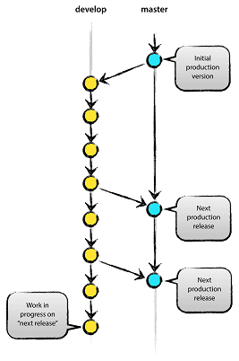
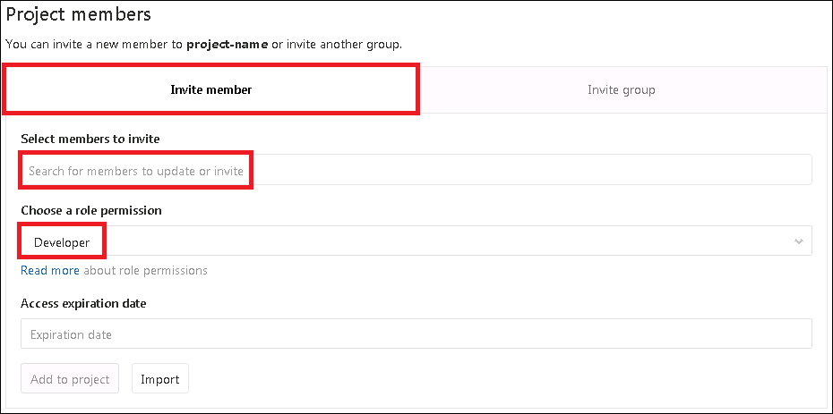
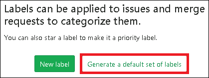
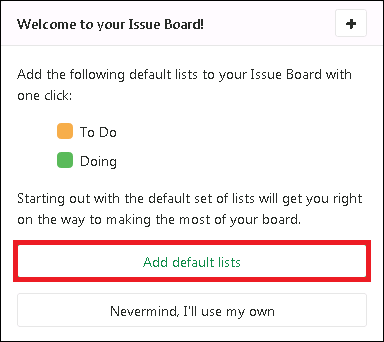
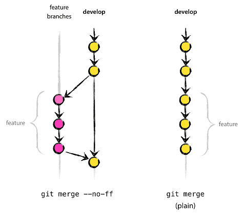
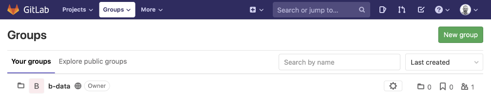

# Git training: Intermediate

> Code doesn't exist unless it's checked into a version control system. Use
> version control for everything you do. Any version control, SVN, Git, even
> CVS, master it and use it.

— [svn - Why should I use version control? - Stack Overflow](https://stackoverflow.com/questions/1408450/why-should-i-use-version-control)

**Goals:**

*  Use a Git gepository with multiple users
*  Apply the concept of Branching/Merging
   *  Avoid merge conflicts
*  Work with Git in RStudio **Terminal**

# Terminology (part 3)

## Git flow

Aka "[a successful Git branching model](https://nvie.com/posts/a-successful-git-branching-model/)"
has been around since 2010 and is still widely used today. From its extensive
concept about branching we focus on the two main branches:

> 
> 
> **The main branches**
> 
> At the core, the development model is greatly inspired by existing models out
> there. The central repo holds **two main branches** with an infinite lifetime:
> 
> * **_master_**
> * **_develop_**
> 
> The _master_ branch at _origin_ should be familiar to every Git user. Parallel
> to the _master_ branch, another branch exists called _develop_. We consider
> _origin/master_ to be the main branch where the source code of `HEAD` always
> reflects a _production-ready_ state.  
> We consider _origin/develop_ to be the main branch where the source code of
> `HEAD` always reflects a state with the _latest_ delivered _development_
> changes for the next release. [...] When the source code in the _develop_
> branch reaches a stable point and is ready to be released, all of the changes
> should be merged back into _master_ somehow [...].

— Vincent Driessen,
[Git flow](https://nvie.com/posts/a-successful-git-branching-model/)

**in short**

*  `HEAD` of _origin/master_ = _production-ready_ state
    *  Changes merged into _master_ = production release _by definition_
*  `HEAD` of _origin/develop_ = _latest developments_

**in addition**

*  Only commit finished features, bugfixes, etc.
*  Merge commits using the `--no-ff` flag

## GitLab

### Members

You can manage the groups and users and their access levels in all of your
projects. You can also personalize the access level you give each user,
per-project.

You should have Maintainer or Owner permissions to add or import a new user to
your project. To view, edit, add, and remove project's members, go to your
project's **Settings > Members**.

#### Add a user

1.  Navigate to your project's **Settings > Members**.  
    
2.  **Select members to invite**.
3.  **Coose a role permission**.  
    :point_right: See
    [Project members permissions](#project-members-permissions) for more
    information.
4.  Click **"Add to project"**.

:information_source: See also [GitLab Help > Project > Members](https://gitlab.com/help/user/project/members/index.md).

### Permissions

Users have different abilities depending on the access level they have in a
particular group or project. If a user is both in a group's project and the
project itself, the highest permission level is used.

On public and internal projects the Guest role is not enforced. All users will
be able to create issues, leave comments, and clone or download the project
code.

#### Project members permissions

While Maintainer is the highest project-level role, some actions can only be
performed by a personal namespace or group owner.

The following table depicts the various user permission levels for the most
important actions in a project.

| Action                                            | Guest   | Reporter   | Developer   |Maintainer| Owner  |
|---------------------------------------------------|---------|------------|-------------|----------|--------|
| Download project                                  | ✓ (*1*) | ✓          | ✓           | ✓        | ✓      |
| Leave comments                                    | ✓ (*1*) | ✓          | ✓           | ✓        | ✓      |
| View project code                                 | ✓ (*1*) | ✓          | ✓           | ✓        | ✓      |
| Pull project code                                 | ✓ (*1*) | ✓          | ✓           | ✓        | ✓      |
| Create new issue                                  | ✓ (*1*) | ✓          | ✓           | ✓        | ✓      |
| Assign issues                                     |         | ✓          | ✓           | ✓        | ✓      |
| Label issues                                      |         | ✓          | ✓           | ✓        | ✓      |
| See a list of merge requests                      |         | ✓          | ✓           | ✓        | ✓      |
| Create new merge request                          |         | ✓          | ✓           | ✓        | ✓      |
| Create new branches                               |         |            | ✓           | ✓        | ✓      |
| Push to non-protected branches                    |         |            | ✓           | ✓        | ✓      |
| Force push to non-protected branches              |         |            | ✓           | ✓        | ✓      |
| Remove non-protected branches                     |         |            | ✓           | ✓        | ✓      |
| Assign merge requests                             |         |            | ✓           | ✓        | ✓      |
| Manage/Accept merge requests                      |         |            | ✓           | ✓        | ✓      |
| Add new team members                              |         |            |             | ✓        | ✓      |
| Enable/disable branch protection                  |         |            |             | ✓        | ✓      |
| Push to protected branches                        |         |            |             | ✓        | ✓      |
| Turn on/off protected branch push for devs        |         |            |             | ✓        | ✓      |
| Edit project                                      |         |            |             | ✓        | ✓      |
| Edit comments (posted by any user)                |         |            |             | ✓        | ✓      |
| Switch visibility level                           |         |            |             |          | ✓      |
| Transfer project to another namespace             |         |            |             |          | ✓      |
| Remove project                                    |         |            |             |          | ✓      |
| Delete issues                                     |         |            |             |          | ✓      |
| Force push to protected branches (*2*)            |         |            |             |          |        |
| Remove protected branches (*2*)                   |         |            |             |          |        |

*  (*1*): Guest users are able to perform this action on public and internal
   projects, but not private projects.
*  (*2*): Not allowed for Guest, Reporter, Developer, Maintainer, or Owner.  
   :information_source: See [GitLab Help > Projects > Protected Branches](https://gitlab.com/help/user/project/protected_branches.md).

:information_source: See also [GitLab Help > User > Permissions](https://gitlab.com/help/user/permissions.md).

### Issues

The GitLab issue tracker is an advanced tool for collaboratively developing
ideas, solving problems, and planning work.

Issues can allow you, your team, and your collaborators to share and discuss
proposals before, and during, their implementation. However, they can be used
for a variety of other purposes, customized to your needs and workflow.

**Common use cases include:**

*  Discussing the implementation of a new idea
*  Tracking tasks and work status
*  Accepting feature proposals, questions, support requests, or bug reports
*  Elaborating on new code implementations

:information_source: See also [GitLab Help > Project > Issues](https://gitlab.com/help/user/project/issues/index.md).

### Labels

Labels allow you to categorize issues and merge requests using descriptive
titles like `bug`, `feature request`, or `docs`. Each label also has a
customizable color. They allow you to quickly and dynamically filter and manage
issues and merge requests you care about, and are visible throughout GitLab in
most places where issues and merge requests are located.

:information_source: See also [GitLab Help > Project > Labels](https://gitlab.com/help/user/project/labels.md).

#### New project label

To create a **default set of labels** for your project and add **default lists**
to the Issue Board:

1.  Navigate to your project's **Issues > Labels**.  
      
    Click **"Generate a default set of labels"**.
2.  Navigate to your project's **Issues > Boards**.  
      
    Click **"Add default lists"**.

# Use cases

## Single user, shared

See [Use cases > Single user, shared](use-cases.md#single-user-shared).  
:point_right: Using RStudio **Terminal**.

## Multiple users

See [Use cases > Multiple users](use-cases.md#multiple-users).

# Hands-on training

## RStudio: Working with Git in the **Terminal**

### List branches and pull changes

1.  List existing branches:
    ```bash
    git branch
    ```
2.  Switch branch, if necessary:
    ```bash
    git checkout <branch>
    ```
3.  Pull changes from _origin_ (GitLab):
    ```bash
    git pull
    ```

### Basic Git workflow

1.  Modify files in your **working directory**.
2.  Add files to the **staging area**:  
    ```bash
    git add .
    ```
    :exclamation: Everything **not** intentionally **specified** in a
    ".gitignore" file to be untracked (ignored) will be added to the
    **staging area**.
3.  Commit changes to the **local repository**:  
    ```bash
    git commit
    ```
    **`git commit`** opens an editor to edit the commit log message and creates
    a new commit containing the current contents of the **staging area**.
4.  Push branch to _origin_ (GitLab):
    ```bash
    git push
    ```

### Single user, shared

*  **Develop** your code on branch _develop_.
    1.  Switch to branch _develop_:
        ```bash
        git checkout develop
        ```
    2.  Modify files in your **working directory**.
    3.  Add files to the **staging area**:  
        ```bash
        git add .
        ```
    4.  Commit changes to the **local repository**:  
        ```bash
        git commit
        ```
    5.  Push branch _develop_ to _origin_ (GitLab):
        ```bash
        git push
        ```
*  **Publish** your code on branch _master_.
    1.  Switch to branch _master_:
        ```bash
        git checkout master
        ```
    2.  Merge branch _develop_ with it:
        ```bash
        git merge --no-ff develop
        ```
    3.  Push branch _master_ to _origin_ (GitLab):
        ```bash
        git push
        ```
    4.  Switch back to branch _develop_:
        ```bash
        git checkout develop
        ```

### Multiple users

**Level "Developer" (or higher)**

*  **Develop** your code on a _\<separate branch\>_:
    1.  Create _\<separate branch\>_ from branch _develop_:
        ```bash
        git checkout develop
        git pull
        git checkout -b <separate branch>
        ```
    2.  Modify files in your **working directory**.
    3.  Add files to the **staging area**:  
        ```bash
        git add .
        ```
    4.  Commit changes to the **local repository**:  
        ```bash
        git commit
        ```
*  **Prepare for merge request:**
    1.  Checkout _target_ branch (_develop_) and pull latest changes:
        ```bash
        git checkout develop
        git pull
        ```
    2.  Checkout _\<separate branch\>_ and merge _develop_ with it:
        ```bash
        git checkout <separate branch>
        git merge --no-ff develop
        ```
    3.  Resolve any merge conflicts on the _\<separate branch\>_.
        ```bash
        git diff
        ...
        git add .
        git merge --continue
        ``` 
    4.  Push _\<separate branch\>_ to _origin_ (GitLab):
        ```bash
        git push
        ```
*  **Ask "Maintainer" (or higher) to merge.**

**Level "Maintainer" (or higher)**

*  **Merge _\<separate branch\>_ into branch _develop_**
    1.  Checkout _\<separate branch\>_ and pull latest changes:
        ```bash
        git checkout <separate branch>
        git pull
        ```
    2.  Checkout branch _develop_ and merge _\<separate branch\>_ with it:
        ```bash
        git checkout develop
        git merge --no-ff <separate branch>
        ```
    3.  Push branch _develop_ to _origin_ (GitLab):
        ```bash
        git push
        ```

### Cherry pick changes

Given an existing commit on one branch, apply the change to another branch:

1.  Checkout the _\<one branch\>_ with the existing commit and pull the latest
    changes:
    ```bash
    git checkout <one branch>
    git pull
    ```
    *  Get the desired commit SHA from GitLab or going through `git log`:
       ```bash
       git log --abbrev-commit --abbrev=8
       ```
2.  Checkout _\<another branch\>_ and pull the latest changes:
    ```bash
    git checkout <another branch>
    git pull
    ```
3.  Cherry pick the commit using the SHA obtained earlier:
    ```bash
    git cherry-pick <commit>
    ``` 
4.  Push _\<another branch\>_ to _origin_ (GitLab):
    ```bash
    git push
    ```

### Tagging

> Like most VCSs, Git has the ability to tag specific points in a repository’s
> history as being important. Typically, people use this functionality to mark
> release points (`v1.0`, `v2.0` and so on).

— [Git - Tagging](https://git-scm.com/book/en/v2/Git-Basics-Tagging)

> #### Adding a tag
> 
> To create a new tag execute the following command:
> 
> ```bash
> git tag <tagname>
> ```
> 
> Replace `<tagname>` with a semantic identifier to the state of the repository
> at the time the tag is being created.
> 
> [...]
> 
> #### Sharing: Pushing tags to remote
> 
> Sharing tags is similar to pushing branches. By default, `git push` will not
> push tags. Tags have to be explicitly passed to `git push`, e.g.:
> 
> ```bash
> git push origin v1.0
> ```
> 
> To push multiple tags simultaneously pass the `--tags` option to `git push`
> command:
> 
> ```bash
> git push --tags
> ```
> 
> When another user clones or pulls a repo they will receive the new tags.

— [Atlassian Git Tutorial - git tag](https://www.atlassian.com/git/tutorials/inspecting-a-repository/git-tag)

:information_source: See
[Git - Tagging](https://git-scm.com/book/en/v2/Git-Basics-Tagging) and
[Atlassian Git Tutorial - git tag](https://www.atlassian.com/git/tutorials/inspecting-a-repository/git-tag)
for more information on annotated tags, lightweight tags, tagging old commits,
deleting tags, etc.

### Submodules

Submodules allow you to keep a Git repository as a subdirectory of another Git
repository. This lets you clone another repository into your project and keep
your commits separate.

#### Starting with Submodules

To add a new submodule you use the `git submodule add` command with the absolute
or relative repository URL of the project you would like to start tracking:

```bash
git submodule add <repository>
```
:information_source: By default, Git checks out the default branch (_master_)

Also by default, submodules will add the subproject into a directory named the
same as the repository. You can add a different path at the end of the command
if you want it to go elsewhere.

You should notice two things:

1.  The new `.gitmodules` file. This is a configuration file that stores the
    mapping between the project’s URL and the local subdirectory you have pulled
    it into.
2.  The subproject's folder entry. Git sees it as a submodule and does not track
    its contents when you are not in that directory. Instead, Git sees it as a
    particular commit from that repository.

#### Cloning a project with submodules

When you clone such a project, by default you get the directories that contain
submodules, but none of the files within them yet.

You must run the two following commands to initialize your local configuration
file, fetch all the data from that submodule and check out the appropriate
commit listed in your project:

```bash
git submodule init
git submodule update
```

#### Pulling in Upstream Changes from the Submodule Remote

The simplest model of using submodules in a project would be if you were simply
consuming and wanted to get updates from it from time to time but were not
actually modifying anything in your checkout.

If you run git `submodule update --remote`, Git will go into your submodules and
fetch and update for you. This command will by default assume that you want to
update the checkout to the master branch of the submodule repository.

— According to
[Git - Submodules](https://git-scm.com/book/en/v2/Git-Tools-Submodules)

:information_source: Check
[Git - Submodules](https://git-scm.com/book/en/v2/Git-Tools-Submodules) for more
information about "Working on a Project with Submodules", "Submodule Tips" and
"Issues with Submodules".

# Terminology (part 4)

## Git commands

### "Inbound"

*  **`git merge --no-ff <branch>`** incorporates changes from the named
   `<branch>` into the current (checked out) branch.  
   :point_right: `git merge` is used by `git pull` to incorporate changes from
   another repository (default: _origin_).

> The `--no-ff` flag causes the merge to always create a new commit object, even
> if the merge could be performed with a fast-forward. This avoids losing
> information about the historical existence of a [...] branch and groups
> together all commits [...]. Compare:  
> 

— Vincent Driessen,
[Git flow](https://nvie.com/posts/a-successful-git-branching-model/)

### Other

*  **`git branch`** without any arguments lists existing branches; the current
    branch will be highlighted in green and marked with an asterisk.
*  **`git stash`** saves your local modifications away and reverts the
   **working directory** to match the `HEAD` commit.  
   :point_right: Calling `git stash` without any arguments is equivalent to
   `git stash push`.
*  **`git stash pop`** applies the stashed (saved) state on top of the current
   **working directory** state, i.e. does the inverse operation of
   `git stash push`.

> **Pulling into a dirty tree**  
> When you are in the middle of something, you learn that there are upstream
> changes that are possibly relevant to what you are doing. When your local
> changes do not conflict with the changes in the upstream, a simple `git pull`
> will let you move forward.
> 
> However, there are cases in which your local changes do conflict with the
> upstream changes, and `git pull` refuses to overwrite your changes. In such a
> case, you can stash your changes away, perform a pull, and then unstash, like
> this:
> ```bash
> $ git pull
>  ...
> file foobar not up to date, cannot merge.
> $ git stash
> $ git pull
> $ git stash pop
> ```

— [Git - git-stash Documentation > Examples](https://www.git-scm.com/docs/git-stash#Documentation/git-stash.txt-Pullingintoadirtytree)

#### Revert and reset

If you already have pushed to a **remote repository**:

*  **`git revert <commit> ...`** is used to make a new commit to reverse the
   effect of some earlier commits (often only a faulty one).  
   :point_right: This requires your **working directory** to be clean (no
   modifications from the `HEAD` commit).

If you only have committed to the **local repository**:

*  **`git reset --hard`** resets the **staging area** and **working directory**.
   Any changes to tracked files in the **working directory** since the `HEAD`
   commit are discarded.  
   :information_source: `git reset --hard` is a synonym for
   `git reset --hard HEAD`.
*  **`git reset --hard HEAD^`** resets the **staging area** and
   **working directory** to the state of the second to last commit (i.e. the
   commit before the `HEAD` commit).
*  **`git reset --hard origin/<branch>`** resets the **staging area** and
   **working directory** and makes the local branch exactly the same
   origin/\<branch\>.
   
   :exclamation: `git reset` is of destructive nature as it deletes files as
   well as commits.

> There are two commands with similar names: `git revert` and `git reset`.
> 
> *  `git revert` is about making a new commit that reverts the changes made by
>    other commits.
> *  `git reset` is about updating your branch, moving the tip in order to add
>    or remove commits from the branch. This operation changes the commit
>    history.
>    
>    `git reset` can also be used to restore the staging area.

— Adapted from [Git - git Documentation > Git commands > Reset, restore and revert](https://git-scm.com/docs/git#_reset_restore_and_revert)

## GitLab

### Groups

With GitLab Groups, you can:

*  Assemble related projects together.
*  Grant members access to several projects at once.

Find your groups by clicking **Groups > Your Groups** in the top navigation.



The **Groups** page displays:

*  All groups you are a member of, when **Your groups** is selected.
*  A list of public groups, when **Explore public groups** is selected.

Each group on the **Groups** page is listed with:

*  How many subgroups it has.
*  How many projects it contains.
*  How many members the group has, not including members inherited from parent
   groups.
*  The group's visibility.
*  A link to the group's settings, if you have sufficient permissions.
*  A link to leave the group, if you are a member.

#### Use cases

You can create groups for numerous reasons. To name a couple:

*  Grant access to multiple projects and multiple team members in fewer steps
   by organizing related projects under the same
   [namespace](https://gitlab.com/help/user/group/index.md#namespaces) and
   adding members to the top-level group.
*  Make it easier to `@mention` all of your team at once in issues and merge
   requests by creating a group and including the appropriate members.

:information_source: See also
[GitLab Help > Groups](https://gitlab.com/help/user/group/index.md).

### Subgroups

Subgroups, also known as nested groups or hierarchical groups, allow you to have
up to 20 levels of groups.

By using subgroups you can do the following:

*  **Separate internal organizations.** Since every group can have its own
   visibility level, you are able to host groups for different purposes under
   the same umbrella.
*  **Organize large projects.** For large projects, subgroups makes it
   potentially easier to separate permissions on parts of the source code.
*  **Make it easier to manage people and control visibility.** Give people
  different [permissions](https://gitlab.com/help/user/permissions.md#group-members-permissions)
  depending on their group [membership](https://gitlab.com/help/user/group/subgroups/index.md#membership).

:information_source: See also [GitLab Help > Groups > Subgroups](https://gitlab.com/help/user/group/subgroups/index.md).

## FAQ

### I have accidentally committed stuff (e.g. data) to the repository. How do I get rid of it again?

:warning: `git reset` is of destructive nature as it deletes files as
well as commits.

#### If you only have committed to the **local repository** (RStudio):

Did it happen during the last commit? Just throw it away:

```bash
git reset --hard HEAD^
```

Did it happen some commits ago? Reset to an older commit:

```bash
git reset <commit>
```
:information_source: Get the desired commit SHA from GitLab or going through
`git log`.

See [Git - git reset Documentation](https://git-scm.com/docs/git-reset/2.17.1#git-reset-emgitresetemltmodegtltcommitgt)
for other modes than `--hard`.

#### If you already have pushed to a **remote repository** (GitLab):

As long as you are working as
[single user, private](use-cases.md#single-user-private) or
[single user, shared](use-cases.md#single-user-shared) you are fine. Just use
one of the commands above and _force push_ to the **remote repository**:

```bash
git push --force
```

:information_source: If you intend to _force push_ to either branch _master_ or
_develop_ you must unprotect it first. See [GitLab Help > Projects > Protected Branches](https://gitlab.com/help/user/project/protected_branches.md).

If you are working on a project with
[multiple users](use-cases.md#multiple-users), _force pushing_ might cause
your collaborators major pain, because you are changing history.  
:point_right: Send them a note and inform about what you are going to do.

See also [Git pretty](http://justinhileman.info/article/git-pretty/full/) on
how to escape a Git mess, step-by-step.

### How do I export a GitLab project?

Follow the instructions on [GitLab Help > Projects > Settings > Exporting a project and its data](https://gitlab.com/help/user/project/settings/import_export.md#exported-contents).  
:information_source: You find "Export project" in Settings > General > Advanced.

You may [import the project](https://gitlab.com/help/user/project/settings/import_export.md#importing-the-project)
back into GitLab at any time. If you are only interested in the Git repository
itself, follow the instructions below.

---

#### Converting a GitLab export to a Git repository

GitLab exports a .tar.gz file which contains a file called "project.bundle". You
can convert this file into a normal Git repository using RStudio **Terminal**.

First, upload the .tar.gz file to a temporary folder in RStudio (e.g.
`~/temp`).

**Extract the project.bundle file**

```bash
cd ~/temp
tar xvfz <gitlab-export>
```

**Restore the bundle to a Git repository**

```bash
mkdir ~/projects/<repository-name>
git clone --bare project.bundle ~/projects/<repository-name>/.git
cd ~/projects/<repository-name>
git init
git checkout master
```

**Change origin to a repository on GitLab**

```bash
git remote set-url origin git@gitlab.com:<user>/<project-name>.git
git push -u origin master
```
:point_right: `<user>` and `<repository-name>` depend on your setup.

Repeat

```bash
git checkout <branch>
git push -u origin <branch>
```

for every branches you intend to push to GitLab.

**Delete temporary folder**

```bash
rm -r ~/temp
```

— Adapted version of [Converting a gitlab export to simple git repo](https://gist.github.com/paulgregg/181779ad186221aaa35d5a96c8abdea7)

---

### Resources

**References**

*  Git flow: https://nvie.com/posts/a-successful-git-branching-model/  
   :point_right: Also available at [references/a-successful-git-branching-model.html](references/a-successful-git-branching-model.html)
   in RStudio.
*  Git Reference: https://git-scm.com/docs
    *  Escape a Git mess, step-by-step: http://justinhileman.info/article/git-pretty/full/  
       :point_right: Open [figures/git-pretty.png](figures/git-pretty.png) to access the file locally.

**Cheat sheets**

*  GitLab cheat sheet: [cheat-sheets/git-cheat-sheet.pdf](cheat-sheets/git-cheat-sheet.pdf)
*  GitHub cheat sheet: [cheat-sheets/git-cheat-sheet-education.pdf](cheat-sheets/git-cheat-sheet-education.pdf)
*  Visual Git cheat sheet: https://ndpsoftware.com/git-cheatsheet.html  
   :point_right: Open [cheat-sheets/git-cheatsheet.html](cheat-sheets/git-cheatsheet.html)
   in RStudio to access the web page locally.
