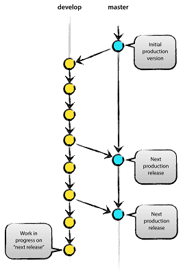
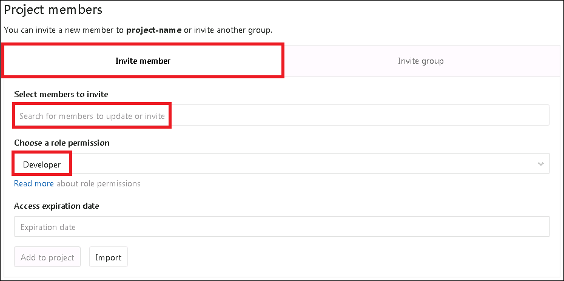

# Git training: Use cases

## Single user, private

As long as you are working on your own, it is entirely up to you how to manage
your RStudio project – with or without GitLab.

### With GitLab

According to

*  "[best practice](https://gitlab.b-data.ch/r/best-practice)"
   [template](https://gitlab.b-data.ch/r/template):
   See [instructions](https://gitlab.b-data.ch/r/template/-/wikis/home)
*  [Clone a project from a Git repository](README.md#clone-your-gitlab-project-with-ssh)

:point_right: When working alone, you can commit and push to a single branch
(default _master_).

### Without GitLab

So be it.

## Single user, shared

### Idea

*  **Develop** your code on branch _develop_.
*  **Publish** your code on branch _master_.

### Git branching model

As soon as you are sharing a project with colleagues, "[a successful Git branching model](https://nvie.com/posts/a-successful-git-branching-model/)"
(also called "Git flow") by Vincent Driessen should be taken into account:



> **The main branches**
> 
> At the core, the development model is greatly inspired by existing models out
> there. The central repo holds **two main branches** with an infinite lifetime:
> 
> * **_master_**
> * **_develop_**
> 
> The _master_ branch at _origin_ should be familiar to every Git user. Parallel
> to the _master_ branch, another branch exists called _develop_. We consider
> _origin/master_ to be the main branch where the source code of `HEAD` always
> reflects a _production-ready_ state.  
> We consider _origin/develop_ to be the main branch where the source code of
> `HEAD` always reflects a state with the _latest_ delivered _development_
> changes for the next release. [...] When the source code in the _develop_
> branch reaches a stable point and is ready to be released, all of the changes
> should be merged back into _master_ somehow [...].

— Vincent Driessen,
[Git flow](https://nvie.com/posts/a-successful-git-branching-model/)

### Create branch _develop_

Since the repository on GitLab is still empty, you must commit our changes and
push them to GitLab first. Without any further changes the _Initial commit_
(use this as **"Commit message"**) will consist of the following files:

1.  ".gitignore"
2.  "\<project-name\>.Rproj"

The _initial commit_ automatically creates branch _master_, both locally
(after commit) and remotely on GitLab (after push). Now, you are able to
create (checkout) branch _develop_ from it:

*  Click **"New branch"**.  
   
    *  Name branch **"_develop_"**.  
       
    *  Click **"Create"**.  
    
    ---
    
    ```bash
    git checkout -b develop
    git push -u origin develop
    ```
    
    **`git checkout -b <branch>`** causes a new branch to be created as if
    `git branch` were called and then checked out.  
    
    **`git push -u origin <branch>`** pushes the checked out **local**
    branch to the corresponding **remote** branch at _origin_ and adds an
    upstream (tracking) reference, used by argument-less `git pull` and other
    commands.
    
    ---

You have now switched to branch _develop_, which is currently in the same state
as branch _master_.

### Protect branch _develop_

GitLab protects branch _master_ by default. A protected branch does four simple
things:

*  it prevents its creation, if not already created, from everybody except
users with "Maintainer" permission
*  it prevents pushes from everybody except users with "Maintainer" permission
*  it prevents **anyone** from force pushing to the branch
*  it prevents **anyone** from deleting the branch

:information_source: Read more about [protected branches](https://gitlab.b-data.ch/help/user/project/protected_branches)
and [project permissions](https://gitlab.b-data.ch/help/user/permissions).

1.  Navigate to your project's **Settings > Repository**.
2.  Scroll to find the **Protected branches** section.  
    
3.  From the **Branch** dropdown menu, select branch **"_develop_"**.
4.  Select **"Maintainers"** from the following dropdown menus:
    *  **Allowed to merge**
    *  **Allowed to push**
5.  Click **Protect**.

Once done, the protected branch will appear in the **Protected branches** list.

### Merge branch _develop_ into _master_

If you have reached a state of work which you want to publish on branch _master_
and share with your colleagues, commit your changes on branch _develop_ and
push them to GitLab first. Then, you merge them into branch _master_:

1.  Open the project's **repository** on GitLab:  [https://gitlab.com/\<user\>/\<project-name\>](https://gitlab.com/\<user\>/\<project-name\>)  
    :point_right: `<user>` and `<project-name>` depend on your setup.
2.  You should see **a message** like the following at the top of the page:  
    
3.  Click **"Create merge request"**.
4.  On the next page you can modify the **"Commit message"** and **assign** it
to a user (i.e. yourself).  
    
5.  Scroll down and click **"Submit merge request"**.
6.  On the next page approve the merge request by clicking **"Merge"**.  
    

:exclamation: This way, branch _master_ in RStudio is **not up to date** with
_origin/master_. You have to pull the merged changes on branch _master_
yourself.

---

```bash
git checkout master
git pull
git merge --no-ff develop
```

:information_source: The default commit message is "Merge branch 'develop'",
which can be replaced by any message you choose.  
:point_right: Exit editor nano with `Ctrl+X`, press `Y` at `Save modified
buffer?` and press `Enter` at `File Name to Write:`.

```bash
git push
git checkout develop
```

:exclamation: Command `git checkout develop` gets you back on branch _develop_,
so that you do not commit development changes to branch _master_ accidentally.

---

### Remember

*  `HEAD` of _origin/master_ = _production-ready_ state
    *  Changes merged into _master_ = production release _by definition_
*  `HEAD` of _origin/develop_ = _latest developments_
*  Only commit finished features, bugfixes, etc.
*  Merge commits using the `--no-ff` flag

## Multiple users

### Prerequisites

1.  [Create branch _develop_](#create-branch-develop)
2.  [Protect branch _develop_](#protect-branch-develop)
3.  Select _develop_ as default branch
    *  Navigate to your project's **Settings > Repository**.
    *  Expand section **Default Branch**.  
    
    *  From the **Default Branch** dropdown menu, select branch **"_develop_"**.
    *  Click **"Save changes"**.

### Idea

**Use GitLab to**

*  invite new members to the project and assign roles
*  manage development by creating issues
*  create branches from issues
*  create merge requests

**Goals**

1.  Allow project collaboration
2.  Set up a unified workflow
3.  Avoid merge conflicts

It is proposed here that there is one **"Maintainer"** for the project who is
solely resposible for branches _develop_ and _master_. Members with role
**"Developer"** commit their contributions to seperate branches which are then
merged back into branch _develop_ by the **"Maintainer"**.  
:point_right: It is always a good idea to define a second **"Maintainer"** as
backup (sick leave, holidays, etc.).

Many git workflows have been proposed over the past years:
[Git flow](https://nvie.com/posts/a-successful-git-branching-model/),
[GitHub flow](http://scottchacon.com/2011/08/31/github-flow.html),
[GitLab flow](https://docs.gitlab.com/ce/workflow/gitlab_flow.html) to name the
most predominant ones. Their purpose is to define a standard so that developers
can move between projects or companies and be familiar with a standardised
workflow.

> Git itself is fairly complex to understand, making the workflow that you use
with it more complex than necessary is simply adding more mental overhead to
everybody’s day.

— Scott Chacon, GitHub

The approach described here combines the principles of "Git flow" (branches
_master_ and _develop_) with the capability of creating a branch for an issue
(from branch _develop_).

### Invite new member to the project and assign role

Users have different abilities depending on the access level they have in
a particular group or project. If a user is both in a group's project and the
project itself, the highest permission level is used.

On public and internal projects the Guest role is not enforced. All users will
be able to create issues, leave comments, and clone or download the project
code.

1.  Navigate to your project's **Settings > Members**.  
    
2.  **Select members to invite**.
3.  **Coose a role permission**.  
    :information_source: See [GitLab Help > User > Permissions](https://gitlab.b-data.ch/help/user/permissions.md)
    for more information.
4.  Click **"Add to project"**.

### Manage development by creating issues

~~"It's not a bug, it's a feature"~~ :point_right: "It's not a bug, it's an
issue – tagged with label
". Everything's an
issue: `bugs`, `enhancements`, `feature requests`, etc. Just tag it with the
appropriate label(s). If a desired label does not exist, create a new one.

Any significant change to the code should start with an issue that describes the
goal. If there is no issue yet, create a new one:

1.  Navigate to your project's **Issues > List**.  
    
2.  Click **"New Issue"**.
3.  Add **Title**, **Assignee** and **Labels**.  
      
    :point_right: The issue title should describe the desired state of the
    system.
4.  Click **"Submit issue"**.

### Create branches from issues

When you are ready to code, create a branch for the issue from branch _develop_:

1.  Navigate to your project's **Issues > List**.
2.  Click on the issue you want to crate a branch for.
3.  Click on the triangle next to **"Create merge request"**.  
    
4.  Select **"Create Branch"** and click **"Create Branch"**.  
    :information_source: The **Branch name** is derived from the issue name
    automatically.

#### RStudio: Pull changes from GitLab

Since the branch for the issue, called _issue-based_ branch from now on, has
been created on GitLab (_origin_), it is not yet visible in RStudio. Pull
changes from GitLab:


---

```bash
git pull
```

---

:exclamation: **Pull changes from GitLab regularly.** It should be your first
action after opening an RStudio project. This gives you an overview on
contributions made by other collaborators.

#### RStudio: Switch to specific branch

Now, you are able to **checkout** the branch locally and contribute to it:


---

```bash
git checkout <no.-issue-name>
```

:point_right: Replace `<no.-issue-name>` with a valid branch name (in this case
"1-add-readme").

---

#### RStudio: Commit and push to GitLab

The idea with _issue-based_ branches is that only a single person (the
**"Assignee"**) is supposed to commit and push his/her contributions. This has
the advantage that you will **never run into conflicts**.

You may ask "Why this? What if someone else changes the same lines of code as
me?". This might well be the case, but based on a different issue and thus on a
different branch – not yet in any relation with your changes.

### Create merge requests

#### Prepare for merge request

Only when you want to merge your contributions with branch _develop_ can merge
conflicts arise. Their resolution is done on the _target_ branch (_develop_) and
is the reposibility of the **"Maintainer"**.

Depending on the number of merge requests, the "Maintainer" must put in
substantial time and effort to resolve conflicts. However, there is a simple way
to prevent them and relieve the "Maintainer":

1.  Merge the _target_ branch with your _issue-based_ branch
2.  Resolve any merge conflicts on the _issue-based_ branch

**Merge the _target_ branch with your _issue-based_ branch**  

---

Checkout _target_ branch (_develop_) and pull latest changes:

```bash
git checkout develop
git pull
```

Checkout _issue-based_ branch and merge _develop_ with it:

```bash
git checkout <no.-issue-name>
git merge --no-ff develop
```

---

:point_right: Replace `<no.-issue-name>` with a valid branch name (in this case
"1-add-readme").

**Resolve any merge conflicts on the _issue-based_ branch**  
If you get the message `Automatic merge failed; fix conflicts and then commit
the result.` RStudio lists the affected files in the **Git pane**:

1.  Git pane:  
    
2.  Open the files and have a look at the conflicts.  
    
3.  Fix all conflicts and remove the conflit markers.  
    
4.  Stage all files by clicking the **Staged** checkbox.  
      
    :exclamation: There might be &#91;**U**&#93;ntracked, &#91;**A**&#93;dded
    &#91;**M**&#93;odified or &#91;**D**&#93;eleted files you want to stage,
    too!

:information_source: In this example there was the **default `README.md`** (
generated by `usethis::use_readme_md()`) in branch _develop_ and a **modified
`README.md`** in the _issue-based_ branch.

**Commit changes to _issue-based_ branch and push to GitLab**

---

```bash
git commit -m "Resolve merge conflicts"
git push
```

---

#### Submit merge request ("Developer")

1.  Open the project's **repository** on GitLab:  [https://gitlab.com/\<user\>/\<project-name\>](https://gitlab.com/\<user\>/\<project-name\>)  
    :point_right: `<user>` and `<project-name>` depend on your setup.
2.  You should see a **message** like the following at the top of the page:  
    
3.  Click **"Create merge request"**.
4.  For _issue-based_ branches GitLab set the **Title** automatically and
    **closes the issue**, assuming that it is resolved.  
    Assign the merge request to the **"Maintainer"**.  
    
5.  Scroll down and click **"Submit merge request"**.

#### Approve merge request ("Maintainter")

1.  Either click on the link in the email you have received or go to your
    project's **Merge Requests** and click on the merge request.
2.  Approve the merge request by clicking **"Merge"**.  
    

:information_source: If there are no changes to the _target_ branch (_develop_)
between the merge request and its approval, no conflicts will occur.

#### About the `WIP:` prefix

While submitting a merge request, you may start the title with `WIP:`. This

1.  prevents a **Work In Progress** merge request from being merged by the
    "Maintainer" before it is ready.
2.  allows the "Developer" to add further commits to the _issue-based_ branch
    and thus the merge request.

:information_source: Remove the `WIP:` prefix from the title to allow the merge
request to be merged by a "Maintainer" when it is ready.

---

If you are a "Maintainer" you may `merge` changes to branch _develop_ locally
and are allowed to `push` to GitLab (_origin_).

```bash
git checkout develop
git pull
git merge --no-ff <no.-issue-name>
git push
```

---

### Remember

*  Protect branch _develop_ and set it as default branch
*  Manage the development of a project by creating _issues_
*  _issue-based_ branches are created from _develop_
*  Resolve conflicts on the _issue-based_ branch

## Cherry-pick changes

GitLab implements Git’s powerful feature to [cherry-pick](https://git-scm.com/docs/git-cherry-pick/2.17.1)
any commit by providing a "Cherry-pick"-button in commit and merge requests
details.

### Cherry-pick a commit

1.  You can cherry-pick a commit from the commit details page:  
    
2.  Select the _target_ branch you want to cherry-pick into:  
      
    :point_right: Untick "Start a **new merge request** with these changes"
    unless you want GitLab to create a merge request.
3.  Click **"Cherry-pick"**.  

:information_source: GitLab should confirm that `The commit has been
successfully cherry-picked into <branch>.`

### Cherry-pick a merge request

After the merge request has been merged, a "Cherry-pick"-button will be
available to cherry-pick the changes introduced by that merge request.

Similar to cherry-picking a commit, you can opt to cherry-pick the changes
directly into the _target_ branch or create a new merge request to cherry-pick
the changes.

Please note that when cherry-picking merge commits, the mainline will always be
the first parent. If you want to use a different mainline then you need to do
that from the command line.

— [GitLab Help > User > Project > Merge requests > Cherry pick changes](https://gitlab.b-data.ch/help/user/project/merge_requests/cherry_pick_changes.md)

# FAQ

## What is the difference between **cloning** and **forking** on GitLab?

Both create a copy of the project:

*  **Cloning** on the client, e.g. where RStudio is running
*  **Forking** on the server, under your own namespace 

From Gitlab [Project forking workflow](https://docs.gitlab.com/ce/user/project/repository/forking_workflow.html):

> Forking a project to your own namespace is useful if you have no write access
to the project you want to contribute to. If you do have write access or can
request it, we recommend working together in the same repository since it is
simpler.
